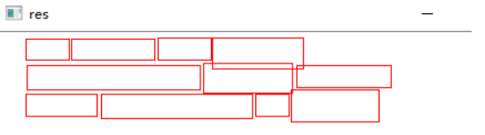
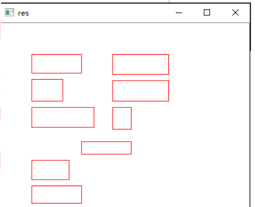
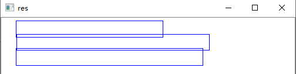
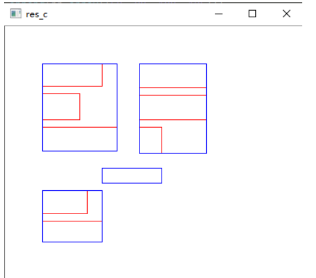
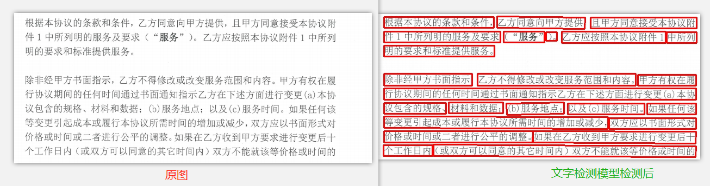
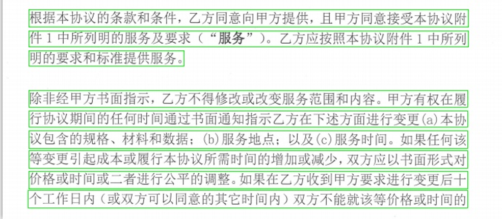
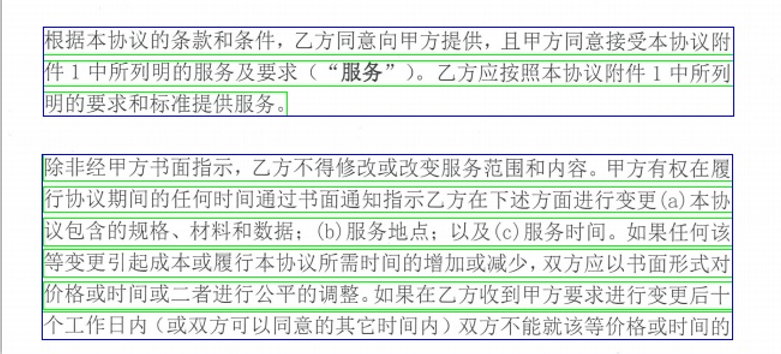
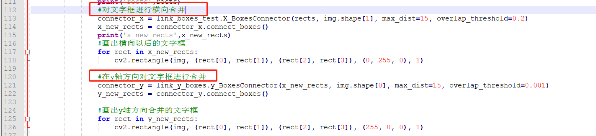

# OCR文字检测框的合并
该代码作为OCR文字检测的后处理模型，被用来对文字检测模型检测出来的文字框进行的合并(e.g. [CRAFT](https://github.com/clovaai/CRAFT-pytorch)) ，
使得同一行的文本尽可能成为一个完整的文字框，为加下来OCR文字识别提供更加完整的文本行.

# 开始
### 文字框生成
- 随机生成两组组文字框，在白纸上画出来，如下图所示： 

### x轴方向合并
- 对于随机生成的文字框，按照x轴方向（即同一行框的合并），如下图所示： 

运行`python link_boxes_test.py `

### y轴方向合并
- 对于随机生成的文字框，按照y轴方向（即区域框的合并），此种合并方式适用于同一张图片上，文字内容分栏，比如论文经常分成两栏，
如果仅仅对于整行文字的合并，对于这种情况不能很好的得到语义连贯的信息。合并情况如下图所示： 

运行 `python link_y_boxes.py `

# 结合文字检测模型进行的文字框的合并
### 使用文字检测模型（[CRAFT](https://github.com/clovaai/CRAFT-pytorch)）检测完以后得到的文字框如下：

### 使用文字框合并算法在X轴方向进行合并，得到如下绿色线的文字框：

### 使用文字框合并算法在Y轴方向进行合并，得到如下蓝色线的文字框：

### CRAFT文字检测模型
- 对于文字检测模型的测试代码以及环境配置，详情可以到[CRAFT](https://github.com/clovaai/CRAFT-pytorch) 参考配置。 
在本地仓库中您需要输入shell命令cd CRAFT_merge进入该目录下：
然后运行Run `python test.py --trained_model=./craft_mlt_25k.pth --test_folder=./input/ ` 在result文件夹下来获得文字检测的框，并且
可以在`file_utils.py`的112行和120行进行注释来获得按X轴方向或者是按照Y轴方向进行文字框的合并。 

# Contact
Feel free to contact me if there is any question:  
My mail address is jhsignal@126.com; 
